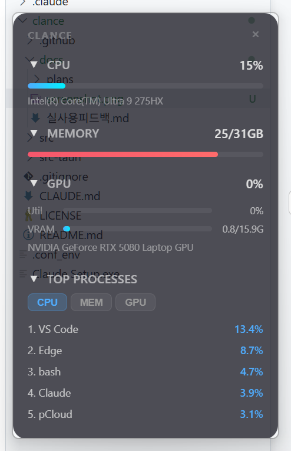

# Clance

> Claude + Glance — A lightweight system monitor widget for your personal PC.




Clance is a desktop widget that shows your system's vital signs at a glance:

- **CPU** usage with per-core details
- **Memory** usage
- **GPU** utilization & VRAM (NVIDIA on Windows)
- **Top 5 processes** by CPU usage

Built with [Tauri](https://tauri.app) for minimal resource footprint (~15MB RAM).

> **Note:** This is a personal desktop utility, not intended for server monitoring or enterprise use.

## Install

Download the latest release from [GitHub Releases](https://github.com/jun0-ds/clance/releases).

## Build from Source

```bash
# Prerequisites: Rust, Node.js, MSVC Build Tools (Windows)
cargo install tauri-cli --version "^2"
cargo tauri dev    # development
cargo tauri build  # production build
```

## License

MIT
